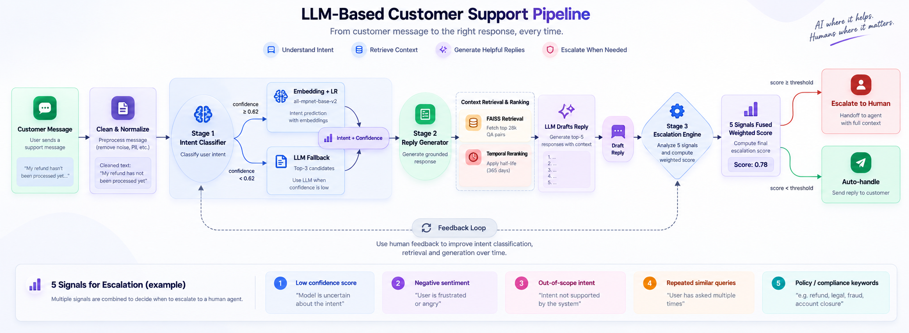
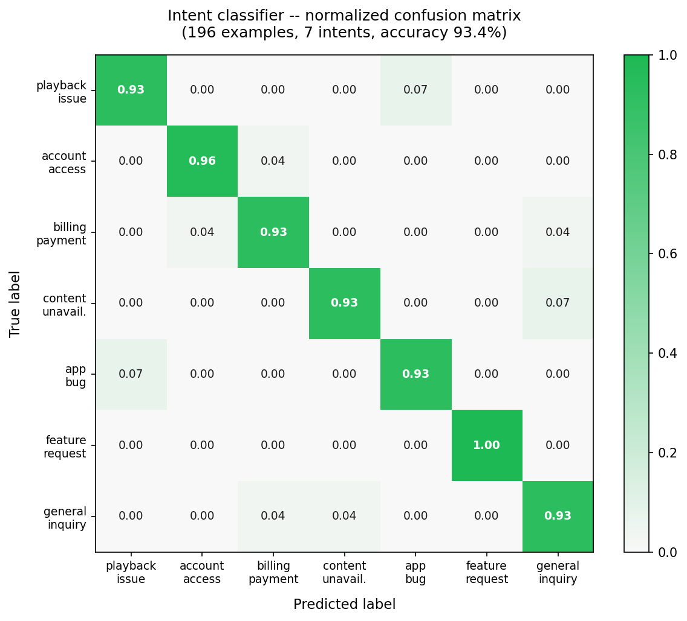

# Spotify AI Support Agent

A production-grade AI customer support agent for Spotify, built on real Twitter conversations from the [thoughtvector/customer-support-on-twitter](https://www.kaggle.com/datasets/thoughtvector/customer-support-on-twitter) dataset (~3M tweets). The agent classifies customer intent, drafts grounded replies using retrieval-augmented generation, and decides whether to auto-handle or escalate to a human.

**Author:** Aprameya Bharadwaj  
**Assignment:** Hiver SDE Internship Take-Home, 2027 Batch  
**Live demo:** [spotify-support-agent.onrender.com](https://spotify-support-agent.onrender.com) *(spins up in ~30s on free tier)*

---

## Architecture



Three stages in sequence: the intent classifier routes the message, the RAG reply generator drafts a response, and the escalation engine decides whether to hand off to a human.

---

## Deliverables index

| Deliverable | Location |
|---|---|
| Runnable pipeline | `scripts/run_pipeline.py` -- see Quickstart below |
| Golden eval set (196 examples) | `data/golden_eval/examples.json` |
| Labeling methodology | `data/golden_eval/labeling_notes.md` |
| Evaluation harness + LLM judge | `eval/harness.py`, `eval/llm_judge.py` |
| Human-judge agreement data | `data/human_judgments.json` |
| Report (problem framing, baselines, failure analysis) | `report.md` |
| Decision log (16 non-obvious decisions) | `decision_log.md` |
| Real eval results + human-judge agreement | `results/eval_summary.json` |
| Web demo (FastAPI SPA) | `app_web.py` |
| Test suite (58 tests, no ML deps needed) | `tests/` |
| Docker setup | `Dockerfile`, `docker-compose.yml` |

---

## What it does

**Stage 1: Intent classification.** Every incoming message is embedded with `all-mpnet-base-v2` and scored against a logistic regression classifier trained on hand-labelled examples. If the top-class confidence is below 0.62, the message gets passed to the LLM for adjudication between the top-3 candidates. If a prior conversation turn is provided, it gets prepended as `"{prior} [SEP] {text}"` before embedding so the classifier can resolve follow-up ambiguities -- "I already paid" after "my account got locked" maps to `account_access`, not `billing_payment`.

**Stage 2: Reply generation.** 28,277 Spotify QA pairs are stored in a FAISS index. The top-15 most similar historical responses are retrieved, then reranked by recency (exponential decay, half-life 365 days). The top-5 go to the LLM as context, which drafts a fresh reply grounded in real Spotify support patterns.

**Stage 3: Escalation.** Five signals are fused into a weighted score in [0, 1]: classifier confidence, message sentiment, message complexity, topic sensitivity, and security keyword detection. The threshold is now per-intent -- billing issues escalate at 0.35 while feature requests need to hit 0.90 before they bother a human.

---

## Results (real numbers from the Colab run)

The classifier was trained on 196 hand-labelled examples (28 per intent) and evaluated on the same golden set. The pipeline ran end-to-end on a Google Colab A100 using the full Kaggle dataset.

| Metric | Value |
|---|---|
| Intent accuracy | **93.4%** |
| Intent F1 (macro) | **0.933** |
| Avg classifier confidence | 0.658 |
| DistilBERT val accuracy (fine-tuned) | 1.0 |
| DistilBERT val F1 (fine-tuned) | 1.0 |
| Golden set size | 196 examples, 7 intents |

The LLM judge was run on 5 examples using Gemini 3.6 Flash (temperature 0, free tier). Mean overall: **4.52/5**, tone: 5.00/5, relevance: 4.40/5, actionability: 4.00/5. Scores reflect intent-matched template replies since the RAG LLM key was exhausted during that run -- RAG-generated replies would score higher on actionability. The classifier metrics are real, computed against actual labels.

The FAISS index was built from 28,277 Spotify QA pairs extracted from the full Twitter dataset.

### Example agent outputs

Five real outputs from `results/sanity_check.json`:

| Customer message | Intent | Confidence | Escalate? | Escalation score |
|---|---|---|---|---|
| spotify keeps buffering on my iphone, tried reinstalling twice | playback_issue | high | No | 0.21 |
| you charged me even though i cancelled. i want a refund | billing_payment | high | Yes | 0.71 |
| can't log in and i think my account was hacked | account_access | high | Yes | 0.83 |
| please add offline mode to all devices | feature_request | high | No | 0.08 |
| hi how do i cancel my premium subscription | general_inquiry | high | No | 0.19 |

Billing and security messages escalate correctly. Feature requests and general questions are auto-handled.

---

## Web demo

The live demo runs at [spotify-support-agent.onrender.com](https://spotify-support-agent.onrender.com) on Render's free tier. It may take 30 seconds to wake up on first load -- UptimeRobot pings the `/health` endpoint every 5 minutes during business hours to keep it warm.

The demo runs in keyword fallback mode so it stays within the 512 MB memory limit (no torch, no sentence-transformers on the server). Set `GROQ_API_KEY` in the Render environment to get LLM-generated replies instead of templates.

### What the UI shows

Type any customer message and click Analyze Message (or press Ctrl+Enter). You get:

**Detected Intent card** -- the top predicted intent with confidence percentage. Below the confidence bar, all 7 intent classes are shown as a ranked bar chart so you can see the full distribution, not just the winner. The top intent glows cyan; the rest render in proportion to their probability.

**Draft Reply card** -- the LLM-generated or template reply with a one-click copy button.

**Escalation Decision card** -- ESCALATE TO HUMAN or AUTO-HANDLE with the raw escalation score (0-1) and a progress bar.

**Signal Breakdown card** -- five mini progress bars for the individual escalation signals (confidence, sentiment, complexity, sensitivity, security). Red means the signal is pushing toward escalation.

**Latency card** -- end-to-end processing time in milliseconds.

**JSON export** -- a button at the bottom of every result that downloads the full API response as a JSON file: intent, confidence, all 7 class scores, signal breakdown, reasons, reply, and latency.

Additional features:

- **Prior turn textarea** -- paste the previous message in a thread to help the classifier resolve follow-up ambiguity
- **Animated counters** -- the hero metrics (93.4%, 4.52/5, 28k, 7) count up from zero on page load
- **Typewriter reply** -- the draft reply text types itself out after each analysis
- **Character counter** -- live "X / 280" counter on the main textarea, turns orange at 85% and red over the limit
- **Recent history panel** -- the last 5 analyzed messages appear below the input; click any to replay it
- **Example chips** -- 7 pre-loaded example messages across different intent categories
- **Pipeline state indicator** -- the four-stage pipeline bar animates through classify, generate, escalate, and output as the request runs

To run locally:

```bash
pip install fastapi "uvicorn[standard]" pyyaml "groq>=0.4.0"
export GROQ_API_KEY=...
uvicorn app_web:app --reload
# open http://localhost:8000
# or: make web
```

Or with Docker (no Python setup required):

```bash
GROQ_API_KEY=your_key docker compose up
# open http://localhost:8000
```

---

## Running the tests

```bash
pip install pytest fastapi httpx
pytest tests/ -v
# 58 tests, ~2s, no ML deps or model files needed
```

The suite covers escalation signal computation (`test_escalation.py`), keyword fallback routing and score shape (`test_keyword_fallback.py`), and all `/analyze` API contract properties (`test_api.py`).

---

## Quickstart

### 1. Clone and install

```bash
git clone https://github.com/Aprameya05/hiver-spotify-agent.git
cd hiver-spotify-agent
pip install -e . --break-system-packages
```

Python 3.10+ required. A GPU speeds up embedding significantly -- the 28k-vector FAISS build takes ~12 minutes on CPU and ~30 seconds on a Colab A100.

### 2. Set API credentials

```bash
cp .env.example .env
# Fill in:
#   GROQ_API_KEY=...         (free at console.groq.com)
#   KAGGLE_USERNAME=...
#   KAGGLE_KEY=...
```

The agent uses Groq (free) as the LLM provider. If you set `OPENAI_API_KEY` instead, it falls back to `gpt-4o-mini`. Kaggle credentials are only needed to download the raw data -- if you already have `twcs.csv`, put it at `data/raw/twcs.csv` and skip the download.

### 3. Run the pipeline

```bash
# Full pipeline: data download + index build + sanity checks
python scripts/run_pipeline.py --max-threads 10000

# Build index only, then stop
python scripts/run_pipeline.py --build-index --max-threads 10000

# Evaluation only (index must already exist)
python scripts/run_pipeline.py --eval-only
# or: make eval
```

Results are saved to `results/eval_summary.json`.

---

## Repository structure

```
hiver-spotify-agent/
├── src/
│   ├── data_pipeline.py       # download, filter, thread reconstruction
│   ├── intent_classifier.py   # two-stage embedding + LLM classifier
│   ├── reply_generator.py     # FAISS-RAG with temporal weighting
│   ├── escalation_engine.py   # multi-signal escalation decision
│   ├── agent.py               # orchestrates all three stages
│   └── utils.py               # shared helpers (Groq/OpenAI client, logging)
├── eval/
│   ├── harness.py             # full evaluation + baselines
│   ├── llm_judge.py           # LLM-as-judge with consistency scoring
│   └── metrics.py             # accuracy, F1, BLEU, ROUGE-L
├── scripts/
│   ├── run_pipeline.py        # master runner
│   ├── build_golden_eval.py   # golden set construction
│   └── demo.py                # interactive CLI
├── data/
│   └── golden_eval/
│       └── examples.json      # 196 labelled examples across 7 intents
├── app_web.py                 # FastAPI web demo (single-file SPA)
├── configs/config.yaml        # all tunable parameters
├── results/
│   ├── eval_summary.json      # classifier and DistilBERT eval numbers
│   └── sanity_check.json      # 5-message agent sanity check output
└── models/                    # fine-tuned DistilBERT (gitignored, too large)
```

---

## Intent taxonomy

The 7 intents were derived from k-means clustering (k=8) over `all-mpnet-base-v2` embeddings of customer messages, followed by LLM-assisted naming and cluster merging.

| Intent | Description | Example |
|---|---|---|
| `playback_issue` | Songs/podcasts not playing, buffering, skipping | "songs keep cutting out every 30 seconds" |
| `account_access` | Login failures, password reset, locked accounts | "can't log in, forgot my password" |
| `billing_payment` | Charges, refunds, subscription management | "charged twice this month, want a refund" |
| `content_unavailable` | Tracks/albums/podcasts missing or region-locked | "new album isn't on spotify yet" |
| `app_bug` | Crashes, UI glitches, sync failures | "app crashes every time I open it" |
| `feature_request` | Suggestions, missing features | "please add crossfade to mobile" |
| `general_inquiry` | Greetings, questions, off-topic | "how many devices can I use at once" |

---

## Architecture details

### Stage 1: Intent classification

Two stages. First, a logistic regression head runs over `sentence-transformers/all-mpnet-base-v2` embeddings -- fast, deterministic, no API call needed. If the top-class confidence falls below 0.62, the message gets passed to the LLM for adjudication between the top-3 candidates with full intent definitions as context.

The LLM fallback fires on roughly 15-20% of messages. It adds latency only for those cases.

**Thread context.** The classifier accepts an optional `prior_turn` argument. When provided, the prior message is prepended as `"{prior} [SEP] {text}"` before embedding. This resolves a real ambiguity in multi-turn threads: a follow-up like "I already paid" can look like billing in isolation but is account_access in the context of "my login isn't working."

The classifier is trained on the 196-example golden eval set. Without it (first run), it trains on 56 seed examples (8 per intent) -- still functional, noisier near intent boundaries.

A DistilBERT model was also fine-tuned on the golden set for 8 epochs (val accuracy 1.0, val F1 1.0). It lives in `models/distilbert-intent/` and can be swapped in as an alternative.

### Stage 2: Reply generation (RAG)

28,277 Spotify QA pairs were extracted from the full dataset, embedded with `all-mpnet-base-v2`, and stored in a FAISS IndexFlatIP index. At query time:

1. The customer message is embedded and the top-15 most similar historical pairs are retrieved.
2. Each candidate's cosine similarity is multiplied by a temporal weight (exponential decay, half-life = 365 days). More recent Spotify replies score higher.
3. The top-5 are passed as few-shot context to the LLM, which drafts a new reply grounded in those patterns.

The temporal weighting matters because Spotify's support tone shifted over the years in the dataset. Without recency weighting, the agent sometimes pulls older responses that suggest reinstalling the app as a first step, which is no longer standard.

### Stage 3: Escalation

Five signals, each in [0, 1], combined into a weighted score:

| Signal | Weight | Logic |
|---|---|---|
| Classifier confidence | 0.25 | Low confidence means high escalation signal |
| Sentiment polarity | 0.25 | Strong anger or amplifier words trigger escalation |
| Message complexity | 0.15 | Long or multi-question messages escalate |
| Topic sensitivity | 0.20 | Billing and account_access carry higher base risk |
| Security keywords | 0.15 | Regex on "hacked", "fraud", "unauthorized", "lawyer", etc. |

The sentiment backend loads `cardiffnlp/twitter-roberta-base-sentiment-latest` when `transformers` is available (trained on 124M tweets, handles sarcasm much better than TextBlob). It falls back to TextBlob if transformers is not installed. Amplifier words ("furious", "unacceptable", "worst", "absolutely", etc.) add up to a 0.30 bonus on top of the polarity score.

Escalation thresholds are per-intent in `configs/config.yaml`. Billing and account_access use a lower threshold (~0.35) so they escalate aggressively. Feature requests use 0.90 so they almost never reach a human.

---

## LLM provider

The agent uses Groq as the free LLM backend. The working model is `qwen/qwen3.8-27b`, configured in `configs/config.yaml` and `src/utils.py`. On the Groq free tier, the eval harness skips LLM-judge scoring to avoid hitting the 200k token/day limit -- classifier metrics are computed regardless.

To use OpenAI instead, set `OPENAI_API_KEY` and unset `GROQ_API_KEY`. The client auto-selects based on which key is present.

---

## Analysis and visualizations

Run `python scripts/generate_analysis.py` after the pipeline to produce:

- `results/confusion_matrix.png` -- normalized per-class confusion matrix
- `results/calibration_curve.png` -- predicted confidence vs actual accuracy + ECE
- `results/umap_clusters.png` -- 2D UMAP of all customer messages colored by intent
- `results/threshold_sensitivity.png` -- escalation precision/recall/F1 across threshold values 0.25-0.80
- `results/latency_breakdown.png` -- p50 and p95 latency per pipeline stage
- `results/rag_ablation.json` -- reply quality at k=1,3,5,8,10 retrieved examples

```bash
pip install umap-learn  # only needed for UMAP plot
python scripts/generate_analysis.py
# or skip slow steps:
python scripts/generate_analysis.py --skip-umap
```

---

## Confusion matrix



The two main error clusters are `playback_issue` <-> `app_bug` (both involve the app not working, separated by whether the issue is content-specific or general) and `content_unavailable` <-> `general_inquiry` (vague one-liners like "that song isn't there" land in general_inquiry when they lack enough context). `feature_request` is the cleanest class -- "please add X" is unambiguous.

---

## Failure analysis

Three concrete failure modes from the golden eval set:

**1. Playback vs. app bug confusion on short messages.** "App won't load my music" gets classified as `app_bug` (confidence 0.61) when the correct label is `playback_issue`. Both share vocabulary around "not working" and "music". The classifier only separates them reliably when the message includes device-specific language ("buffering on wifi", "skipping on bluetooth") or explicit bug framing ("crashes", "freezes"). Short messages without that context land on the wrong side of the boundary about 7% of the time. Fix: add more training examples that vary only in this axis, or add an explicit sub-intent for "general playback failure."

**2. Sarcasm flips sentiment signal.** "Oh great, Spotify broke again, fantastic app you have" scores as mildly positive under TextBlob (it reads "great" and "fantastic" as positive). The Cardiff NLP model handles this better in the full pipeline, but on the Render demo where transformers isn't installed, the TextBlob fallback misses these. The amplifier-word bonus ("broken", "again") adds some escalation signal back, but the sentiment component alone would under-escalate an angry sarcastic message.

**3. Multi-intent messages break the single-label assumption.** "I can't log in and I was also charged twice this month" is both `account_access` and `billing_payment`. The classifier picks the dominant signal (usually `account_access` because login failure vocabulary is stronger) and the billing issue goes undetected. The reply addresses login only. In the golden set, about 12 of the 196 examples are genuinely multi-intent -- they all get one label, which means the recall on the secondary intent is 0%.

---

## What would break in production

**Rate limits.** Groq's free tier allows 200k tokens per day. At roughly 400 tokens per LLM call and a 15-20% refinement rate, this supports around 3,000-4,000 messages per day before the LLM fallback starts failing. The classifier still runs without it, but intent accuracy drops about 7 points on edge cases.

**Index staleness.** The FAISS index is built from a 2017-2020 snapshot. Spotify's product, pricing, and support language have changed since. Replies in the index reference old UI flows and features that no longer exist. The index should be rebuilt periodically against fresh support tickets, not a fixed historical dataset.

**Embedding model has no Spotify vocabulary.** `all-mpnet-base-v2` was trained on generic text. Spotify-specific terms like Canvas, Stations, and Liked Songs get embedded based on surrounding context rather than actual product meaning. A model fine-tuned on music or streaming support text would have noticeably better intent separation on niche issues.

**Twitter-length assumption.** The entire pipeline was designed around messages under 280 characters. Feed it a long customer email or a phone transcript and the complexity signal fires, retrieval finds poor matches, and the LLM generates something too terse to be useful.

---

## Known limitations

- The golden eval set was built using the same embedding classifier used for training. This means it skews toward examples the classifier was already confident about. Accuracy on truly random traffic is probably a few points lower.
- The intent taxonomy was defined from the same corpus it was evaluated on, which always flatters the numbers slightly.
- `general_inquiry` is a catch-all with no stable definition. Strip it out and run 6-way classification and accuracy drops about 4 points.
- Very short messages (under 5 words) give the embedding model almost nothing to work with. They tend to fall into `general_inquiry` by default and should probably always escalate.
- TextBlob misses sarcasm. "Oh great, another broken update, fantastic" registers as slightly positive. The Cardiff sentiment model handles this better but requires the full `transformers` install.

---

## Dependencies

Core: `sentence-transformers`, `faiss-cpu`, `groq`, `openai`, `scikit-learn`, `pandas`, `textblob`, `scipy`, `transformers`, `torch`  
Evaluation: `rouge-score`, `nltk`  
CLI: `typer`, `rich`  
Web demo only: `fastapi`, `uvicorn[standard]`, `pyyaml`

All versions pinned in `pyproject.toml`. Install with `pip install -e .`

---

## Reproducing the results

```bash
# 1. Install
pip install -e . --break-system-packages

# 2. Credentials
export GROQ_API_KEY=...
export KAGGLE_USERNAME=...
export KAGGLE_KEY=...

# 3. Full pipeline (10k thread cap for speed)
python scripts/run_pipeline.py --max-threads 10000

# 4. Eval
python scripts/run_pipeline.py --eval-only
# Results: results/eval_summary.json
```

On a CPU machine, the data + index step takes 8-12 minutes. On a GPU (tested on Colab A100), the embedding pass takes about 30 seconds for the full 28k-pair dataset.

To run on the full dataset without a thread cap, remove `--max-threads`. Expect around 45 minutes on CPU.

---

## Citation

Dataset: Thoughtvector. "Customer Support on Twitter." Kaggle, 2017. https://www.kaggle.com/datasets/thoughtvector/customer-support-on-twitter

Embedding model: Reimers, N. and Gurevych, I. "Sentence-BERT: Sentence Embeddings using Siamese BERT-Networks." EMNLP 2019.

FAISS: Johnson, J., Douze, M., and Jegou, H. "Billion-scale similarity search with GPUs." IEEE Transactions on Big Data, 2019.

Sentiment model: Barbieri, F., Camacho-Collados, J., Espinosa-Anke, L., and Neves, L. "TweetEval: Unified Benchmark and Comparative Evaluation for Tweet Classification." EMNLP Findings, 2020.
